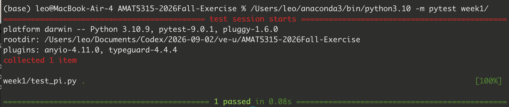

# AMAT5315-2026Fall Exercise

This public repository contains my in-class exercises for AMAT5315-2026Fall. Week 1 uses a seeded Monte Carlo simulation to estimate π and records a test-first Git workflow.

## Requirements

- Python 3.10 or newer
- pytest

Install the test runner:

```bash
python3 -m pip install pytest
```

## Run the test

From the repository root, run:

```bash
python3 -m pytest week1/
```



The screenshot shows `python3 -m pytest week1/` collecting one test and finishing with `1 passed`.
