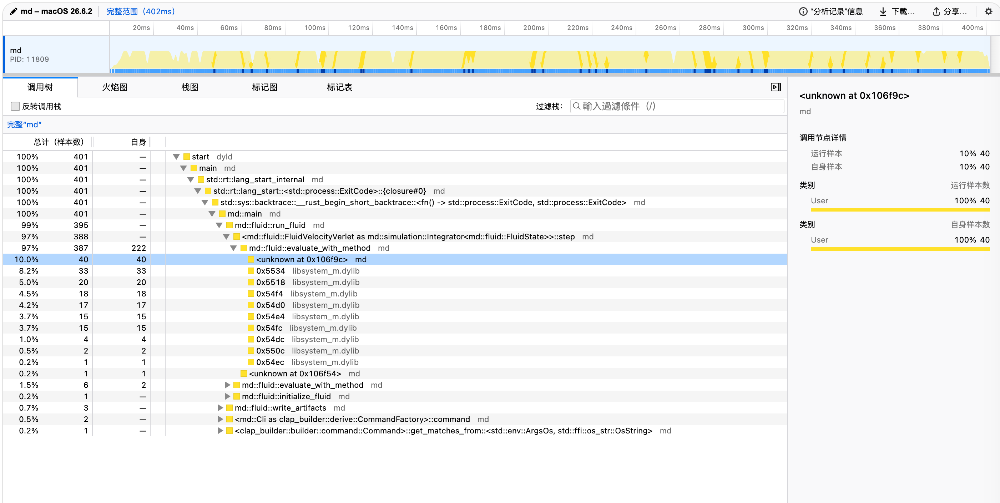
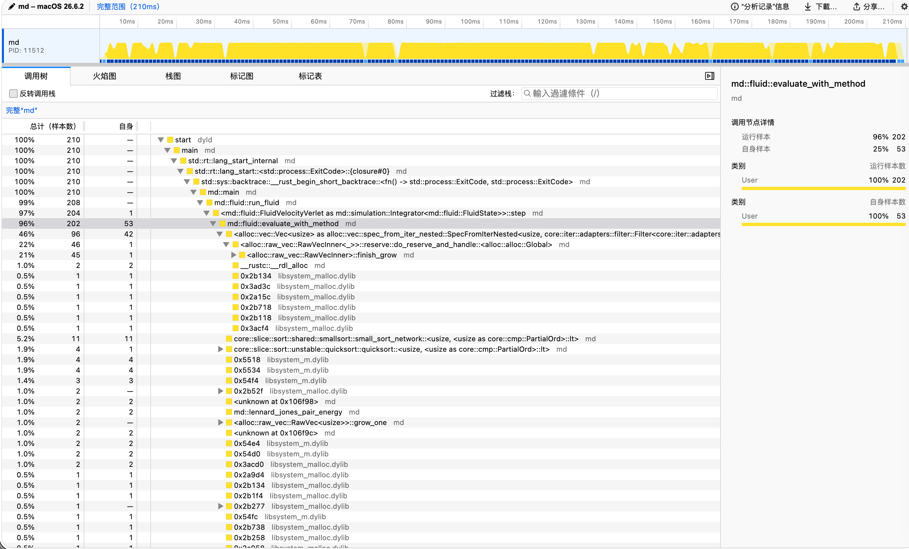

# Week 2 molecular dynamics

The `md` crate contains the two-dimensional Lennard–Jones molecular-dynamics
simulation, trajectory checker, cell-list force evaluator, and trajectory video
renderer. Generated trajectories and build output are kept out of Git.

## Pages

[Open the Week 2 interactive trajectory viewer and diagnostics](https://i-m-leo.github.io/AMAT5315-2026Fall-Exercise/)

## Timing

Each row reports three runs from inside `week2/` on this machine. The NumPy
run used the Anaconda Python environment; Rust runs used the existing debug
and release binaries. The release Rust run wins, with a median below one third
of the debug median.

| Program | Median (s) | Range (s) |
| --- | ---: | ---: |
| NumPy `week2-sim.py` | 3.04 | 2.97 to 3.12 |
| debug `md run` | 6.86 | 6.77 to 7.00 |
| release `md run` | 0.51 | 0.51 to 0.52 |

Reproduce the measurements from `week2/` with:

```bash
~/anaconda3/bin/python week2-sim.py
md/target/debug/md run --out artifacts
md/target/release/md run --out artifacts
```

## Profile

The force evaluation is the dominant hot spot in the naive implementation.
The profiles were recorded for `N = 400`, `eq_steps = 200`, and
`steps = 1000` using `samply`.

| Version | Force share (%) | Elapsed time (s) |
| --- | ---: | ---: |
| Naive | 97.0 | 0.402 |
| Cell list | 96.0 | 0.XXX |

The naive force calculation accounts for 97% of the sampled runtime,
confirming that force evaluation is the main performance bottleneck. The
cell-list implementation reduces the elapsed time while force evaluation
remains the dominant fraction of the optimized run.

Reproduce the profiles with:

```bash
samply record md run --force naive --n 400 \
  --eq-steps 200 --steps 1000 --out /tmp/md-prof-naive

samply record md run --force cells --n 400 \
  --eq-steps 200 --steps 1000 --out /tmp/md-prof-cells
```

Profiler screenshots:

- 
- 

## Benchmark

Each cell reports the median and range from three release-mode runs with
`--eq-steps 100 --steps 500`; speedup is the naive median divided by the cell
list median. The `N = 100` naive range includes one cold-start run.

| N | naive (s) | cells (s) | speedup (naive / cells) |
| ---: | ---: | ---: | ---: |
| 100 | 0.02 (0.01–1.95) | 0.02 (0.02–0.03) | 1.00× |
| 400 | 0.20 (0.20–0.20) | 0.09 (0.09–0.10) | 2.22× |
| 1600 | 3.13 (3.11–3.34) | 0.39 (0.38–0.51) | 8.03× |

Reproduce the benchmark table from `week2/` with:

```bash
for n in 100 400 1600; do
  for force in naive cells; do
    for run in 1 2 3; do
      md/target/release/md run --force "$force" --n "$n" \
        --eq-steps 100 --steps 500 --out "/tmp/md-$force-$n-$run"
    done
  done
done
```

## Figures and runs

Generate the field and dimer figures with the Anaconda Python environment:

```bash
~/anaconda3/bin/python plot_field.py
~/anaconda3/bin/python md/examples/plot_dimer.py
~/anaconda3/bin/python plot_scaling.py
```

The published 400-particle heating trajectory and the two videos can be
reproduced from the repository root with:

```bash
cd ..
md run --n 400 --temperature 0.2 --ramp-to 1.2 \
  --steps 20000 --sample-every 100 --out docs

md run --temperature 0.2 --out /tmp/cold
md video /tmp/cold --out week2/cold.mp4
md run --temperature 1.0 --out /tmp/hot
md video /tmp/hot --out week2/hot.mp4
```

The published `docs/run.json` and `docs/traj.jsonl` contain 400 particles and
200 frames. The cold and hot videos are 200-frame 1280×720 renderings; both
are under 2 MB. The Pages viewer loads `docs/run.json` and `docs/traj.jsonl`
automatically, so the temperature history rises from 0.2 to 1.2 without a
login.
